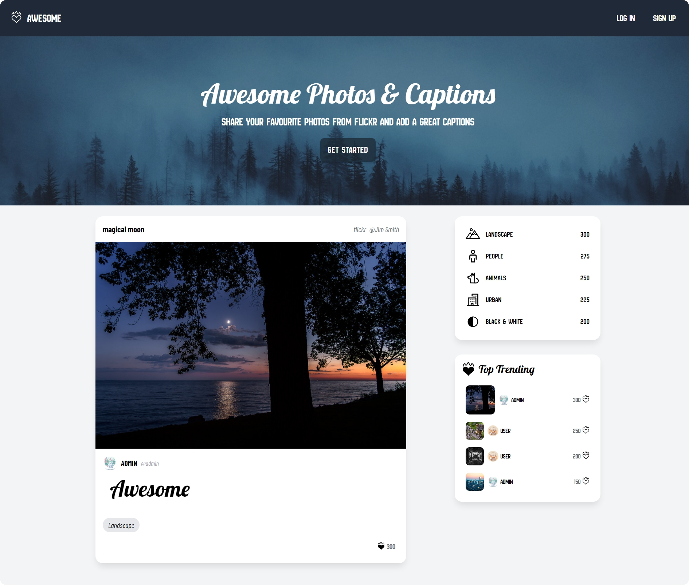

# AWESOME WEB APPLICATION



<p align="justify">
    <em>
        Awesome is meticulously crafted with a focus on simplicity and user convenience, replicating the essential features of the original Instagram. This innovative platform invites users to explore a fresh social media experience, where they can effortlessly and swiftly share their daily photos and stories. With an intuitive interface and streamlined functionality, Awesome enhances the social sharing experience, allowing users to capture and showcase life's moments with ease. Additionally, its integrated real-time chat feature enables dynamic, instant conversations, making the platform not only a space for sharing but also for meaningful interaction.
    </em>
</p>

## 1. PROJECT

```
git clone https://github.com/BIN-PDT/WEBAPP_AWESOME.git && rm -rf WEBAPP_AWESOME/.git
```

_For privacy reasons, replace the sensitive information in `a_core/.env` with your own._

-   _Replace `EMAIL_ADDRESS` & `EMAIL_PASSWORD` (Application Password) with your Gmail Account_.

-   _Generate `SECRET_KEY`_.

    ```
    python manage.py shell
    ```

    ```python
    from django.core.management.utils import get_random_secret_key
    print(get_random_secret_key())
    exit()
    ```

-   _Generate `ENCRYPT_KEY`_.

    ```
    python manage.py shell
    ```

    ```python
    from cryptography.fernet import Fernet
    print(Fernet.generate_key())
    exit()
    ```

## 2. VIRTUAL ENVIRONMENT

```
python -m venv .venv
```

```
.venv\Scripts\activate.bat
```

## 3. DEPENDENCY

```
python.exe -m pip install --upgrade pip
```

```
pip install -r requirements.txt
```

## 4. DATABASE

```
python manage.py makemigrations
```

```
python manage.py migrate
```

```
python manage.py shell
```

```python
from scripts.utils import load_data
load_data()
exit()
```

## 5. RUN APPLICATION

```
python manage.py runserver
```
